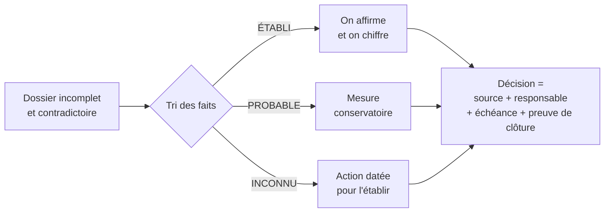

# Solvia : remettre une entreprise sous contrôle en 90 jours

> Étude de cas de direction technique (Mastère CTO & Tech Lead, HETIC, septembre 2026).
> On reprend la direction technique d'une scale-up SaaS de 180 personnes, trois semaines après le départ sans passation de son CTO. On a cinq jours, un dossier incomplet et contradictoire, et un conseil d'administration qui « a été rassuré pendant dix-huit mois » et n'en veut plus.

**Pas une ligne de code n'était autorisée : c'est un exercice de décision, pas d'ingénierie.** Ce repo montre comment on a lu, tranché, chiffré et défendu nos choix, puis ce qu'on ferait de plus avec du recul.

---

## Le cas en 30 secondes

| | |
|---|---|
| **Entreprise** | Solvia SAS (fictive) : SaaS de gestion locative, 11,2 M€ d'ARR, 340 agences et 11 bailleurs institutionnels |
| **Finances** | 18,6 M€ de trésorerie, un burn de 1,33 M€/mois, donc **14 mois de runway** |
| **Budget tech** | 5 497 000 €/an, puis **une coupe de 20 % imposée en cours de route** |
| **Ce qui brûle** | Une panne totale de 6 h 08, un module qui encaisse ~933 k€/mois et qui repose sur une seule personne, un algorithme qui rend 28 000 décisions de logement par mois sans aucune gouvernance |

## Notre thèse

> **Solvia laisse tourner des systèmes critiques sans maîtrise collective.**
> Il y a deux boîtes noires :
> - **une boîte noire technique et humaine** : la base tombe, l'alerte sonne 4 h 28 dans le vide, une seule personne sait réparer ;
> - **une boîte noire algorithmique** : un score influence l'accès au logement, et personne ne sait le justifier.
>
> Le problème n'est jamais l'incident isolé, c'est l'absence de gouvernance qui le rend possible et le laisse se répéter.

## Ce que contient ce repo

| # | Document | Ce qu'il démontre |
|---|---|---|
| 00 | [Le cas et les règles du jeu](docs/00-le-cas.md) | Notre synthèse du dossier : les 11 pièces, les rôles, les imprévus injectés |
| 01 | [Relevé des contradictions](docs/01-contradictions.md) | **Détection** : ce que les pièces se contredisent, et ce qu'on a trouvé en plus à la relecture |
| 02 | [Diagnostic établi / probable / inconnu](docs/02-diagnostic.md) | **Honnêteté** : séparer ce qu'on sait de ce qu'on suppose |
| 03 | [Post-mortem de l'incident du 14 février](docs/03-post-mortem-incident.md) | Blameless : on distingue le déclencheur des causes systémiques |
| 04 | [Position sur Solvia Score](docs/04-position-score.md) | Éthique, RGPD, parallèle avec l'algorithme de la CNAF, position commerciale |
| 05 | [Budget révisé et coupe de 20 %](docs/05-budget-revise.md) | **Arbitrage** : 1 099 400 € de coupes sans toucher aux personnes ni à la fiabilité |
| 06 | [Personnes et continuité de la facturation](docs/06-personnes-continuite.md) | Bus factor = 1 : passation mesurable, gestion humaine d'un départ en épuisement |
| 07 | [Réponse au directeur commercial (deal à 400 k€)](docs/07-reponse-commerciale.md) | Savoir dire non à une date impossible sans tuer le deal |
| 08 | [Décisions, renoncements, registre](docs/08-decisions-registre.md) | **Ce qu'on décide de ne pas faire**, et pourquoi |
| 09 | [Plan à 90 jours](docs/09-plan-90-jours.md) | Sécuriser, tester, déployer, prouver |
| 10 | [Soutenance devant le conseil](docs/10-soutenance.md) | Le support, la banque de questions et réponses, les pièges et leurs parades |
| 11 | [**Au-delà de la copie : vision CTO**](docs/11-vision-cto.md) | Ce qu'on ferait avec du recul : pistes hors du cadre, leçons de leadership |
| 🔧 | [`outils/verif_calculs.py`](outils/verif_calculs.py) | Tous les chiffres du dossier recalculés et reproductibles (écrit après l'exercice) |

## Les chiffres qui comptent

- **−1 099 400 €** de coupes (−20 %), dont **323 700 € prouvés et immédiats** : cluster GPU utilisé à 3 % et éteint, sièges SaaS jamais utilisés.
- **268 000 €** réinvestis dans la fiabilité : infrastructure et astreinte, SRE, renfort facturation, analyse d'impact RGPD.
- On n'a **pas touché à la masse salariale** : « économiser aujourd'hui en payant plus cher dans six mois n'est pas une économie ».
- **3 décisions demandées au conseil** : valider le plafond à 4 397 600 €, autoriser la suspension conservatoire du Score avec un audit sous 48 h, protéger les relais sur la facturation et la production.

## Ce que ce cas nous a appris

1. **Un dossier ment rarement, mais il se contredit souvent.** Le travail commence par le tri des faits, pas par les solutions.
2. **« Erreur humaine » n'est jamais une cause racine.** C'est un déclencheur. La vraie question est pourquoi une seule opération peut couler toute la plateforme.
3. **Un humain dans la boucle n'est pas un contrôle** quand il suit la recommandation 61 % du temps sans la modifier.
4. **Une position éthique sans chiffrage n'est pas une décision de dirigeant.** Si on arrête quelque chose, on dit ce que ça coûte.
5. **Le préavis est un cadre, pas un plan de continuité.**

## Équipe

Travail de groupe à 4 rôles (direction technique, personnes, finance, conformité), Mastère CTO & Tech Lead, HETIC.

- **Ahmed Sayeh** ([@ahmvdd](https://github.com/ahmvdd)), rôle **Finance** : budget révisé, scénarios d'arbitrage, provisions, bible de soutenance
- **Melvin Becue** : post-mortem de l'incident, analyse croisée CNAF / Solvia, plan d'action CTO sur le départ de Thomas
- Et nos deux coéquipiers des rôles direction technique et conformité

---

Solvia SAS, ses salariés et ses chiffres sont **fictifs** : c'est un support pédagogique de HETIC. Ce repo ne reproduit pas le dossier original, il en présente notre synthèse et nos livrables. Le cas réel de la CNAF, cité en comparaison, s'appuie sur des informations publiques.
