# 03 · Post-mortem : incident du 14 février

> **SEV-1 proposé.** Indisponibilité totale de la plateforme pendant 6 h 08.
> Format *blameless* : on cherche pourquoi le système a permis la panne, pas qui a appuyé sur le bouton.
> *Livrable rédigé par Melvin Becue, adapté pour ce repo.*

## 1. Résumé exécutif

Le 14 février, la plateforme a été totalement indisponible de **03 h 12 à 09 h 20**. Une alerte est bien partie à 03 h 12, mais personne ne l'a prise en charge avant **07 h 40**. La base principale ne répondait plus et, faute de bascule automatique, il a fallu la rétablir à la main.

« L'erreur humaine lors d'un déploiement » du rapport officiel est **au mieux le déclencheur probable**. Elle n'explique pas :

- pourquoi une opération unique a pu arrêter **toute** la plateforme ;
- pourquoi l'alerte est restée sans réponse pendant **4 h 28** ;
- pourquoi la restauration a demandé **1 h 40** de plus.

**Le service est rétabli, mais l'incident n'est pas clos** : 3 quasi-incidents similaires ont eu lieu depuis, et aucune protection structurelle n'a été mise en place.

## 2. Chronologie

```mermaid
gantt
    title 14 février : 6 h 08 d'indisponibilité
    dateFormat HH:mm
    axisFormat %H:%M
    section Détection
    Alerte émise, personne ne répond   :crit, 03:12, 07:40
    section Reprise
    Découverte, diagnostic, remontée manuelle de la base :active, 07:40, 09:20
```

| Heure | Événement |
|---|---|
| 03 h 12 | Une alerte signale l'incident |
| 03 h 12 → 07 h 40 | **Rien.** Pas d'astreinte, pas d'escalade |
| 07 h 40 | Le SRE découvre le problème en se connectant : la base principale ne répond plus |
| 07 h 40 → 09 h 20 | Diagnostic, puis remise en service manuelle, sans bascule |
| 09 h 20 | Retour du service |
| Après | Le rapport client parle d'« erreur humaine » et classe l'incident comme clos. **Aucune action n'est tracée** |

## 3. Établi et non établi

| Établi | Non établi |
|---|---|
| Indisponibilité totale de 6 h 08 | La modification exacte, son auteur, son mécanisme |
| Alerte non traitée pendant 4 h 28 | L'existence et la qualité des journaux de déploiement |
| Pas de bascule automatique | L'état des sauvegardes, les RTO et RPO |
| Remise en service manuelle | Une perte ou corruption de données |
| Préprod non représentative de la prod | Le volume d'utilisateurs et de transactions touchés |
| Exploitation dépendante d'un seul SRE | Le montant contractuel réellement exigible |
| 3 quasi-incidents depuis | Le contenu du « renforcement des procédures » annoncé |

## 4. Analyse causale

**Déclencheur probable** : une opération de déploiement. Mais il n'y a ni journal, ni ticket, ni preuve technique. **Attribuer la panne à une personne serait incomplet et non démontré.**

**Causes profondes** :

1. **Point unique de défaillance** : une base principale sans bascule. Le réplica de lecture n'est pas une stratégie de reprise.
2. **Détection sans réponse** : la supervision alerte, mais personne n'est chargé de répondre.
3. **Prévention insuffisante** : la préprod ne ressemble pas à la prod, donc on ne teste rien de réaliste.
4. **Dépendance humaine** : une seule personne sait déployer et reprendre la production.
5. **Gouvernance défaillante** : le déclencheur a été traité comme la cause, et l'incident fermé sans preuve que le risque avait baissé.
6. **Risque connu et ignoré** : 40 k€ d'infrastructure et un poste demandés en mars, sans suite.

## 5. Plan d'actions

| # | Action | Propriétaire | Échéance | Preuve de clôture |
|---|---|---|---|---|
| A1 | Encadrer les changements à risque : validation à deux rôles, plan de retour arrière | EM | J+3 | 3 changements consécutifs conformes |
| A2 | Astreinte et escalade | Direction tech | J+7 | **Alerte hors heures acquittée en moins de 10 min** |
| A3 | Contrôler l'intégrité des données, tester une restauration chronométrée | Lead Backend et SRE | J+7 | RTO et RPO mesurés, rapport signé |
| A4 | Tracer l'incident et les 3 quasi-incidents | SRE | J+7 | 4 dossiers complets |
| A5 | Haute disponibilité testée | Direction tech et SRE | Conception J+15, exercice J+60 | Bascule démontrée en exercice |
| A6 | Préprod représentative des chemins critiques | EM | J+45 | Déploiement et rollback testés |
| A7 | Réduire la dépendance à une seule personne | Direction tech et Personnes | Binôme J+30, autonomie J+90 | Reprise exécutée sans le référent |
| A8 | Chiffrer l'exposition contractuelle | DAF et juridique | J+7 | Note chiffrée et décision tracée |
| A9 | Gouvernance de fiabilité : SLO, budget d'erreur, revue mensuelle | Direction tech | J+30 | Première revue tenue |

## 6. Critères de clôture

L'incident reste « **rétabli, actions ouvertes** » tant que tous ces critères ne sont pas remplis :

- [ ] une astreinte testée répond en moins de 10 minutes
- [ ] une bascule de la base réussit lors d'un exercice contrôlé
- [ ] les RTO et RPO sont mesurés et acceptés
- [ ] au moins deux personnes savent déployer et reprendre la production
- [ ] les 3 quasi-incidents sont documentés et reliés à des actions
- [ ] l'exposition contractuelle est chiffrée, et une décision est enregistrée

## 7. Exposition contractuelle

Les onze contrats institutionnels prévoient un **SLA à 99,9 %**, avec une pénalité de **5 % de la redevance mensuelle par tranche de 0,1 % manquante**.

- Écart : 99,9 % − 99,15 % = 0,75 point, soit 7,5 tranches, donc **37,5 % de la redevance mensuelle**, et ce pour 11 clients (35 % ou 40 % selon la règle d'arrondi).
- **Montant non chiffrable** : les redevances par bailleur ne figurent pas au dossier. On donne la **méthode et la fourchette, jamais un montant inventé.**
- Voir aussi la contradiction n° 8 : sur 28 jours, la disponibilité réelle serait de 99,09 %.
