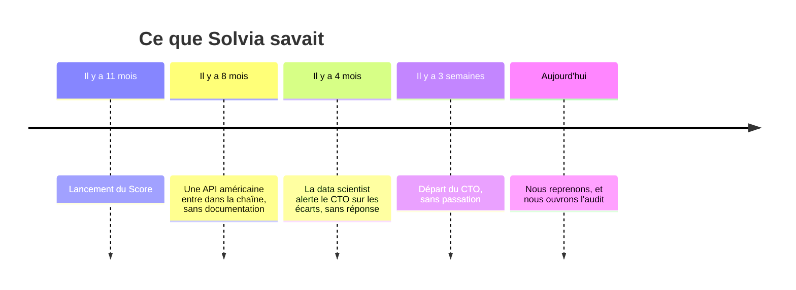

# 04 · Position sur Solvia Score

> *« Le constat justifie un audit. Il ne prouve pas à lui seul une discrimination. »*

## Ce que Solvia vend, et ce que Solvia a

| | Plaquette commerciale (P.1) | Réalité (P.6, P.8) |
|---|---|---|
| Technologie | « IA propriétaire » | Un modèle de gradient boosting, **plus une API externe américaine** depuis 8 mois pour l'analyse des pièces et l'extraction des revenus |
| Données | « Plus de 2 millions de dossiers » | **~190 000 dossiers** |
| Documentation | — | Aucune AIPD retrouvée, aucun service juridique |
| Contrôle humain | « Recommandation » | **61 %** des recommandations suivies sans modification |
| Transparence | — | Le candidat **n'est pas informé** du traitement automatisé |

## Ce que les chiffres montrent (P.8, 214 000 dossiers sur 6 mois)

| Zone | Taux de recommandation défavorable |
|---|---|
| Ensemble | 18,4 % |
| Paris intra-muros | 12,1 % |
| Grandes communes, zone A | 16,8 % |
| **Quartiers prioritaires (QPV)** | **33,9 %** (×2,8 par rapport à Paris) |
| Zones rurales | 21,3 % |

Le code postal **n'est pas** une variable d'entrée. Mais le type de contrat, l'ancienneté, le garant et le revenu **peuvent agir comme proxys** du territoire et de la précarité. **Retirer une variable ne retire pas son effet** : il faut mesurer les résultats par groupe.

## Chronologie de la connaissance : « que saviez-vous, et depuis quand ? »

**Établi** : l'alerte il y a 4 mois, l'API américaine depuis 8 mois, le lancement il y a 11 mois.
**Non établi** : ce qui a été fait entre l'alerte et aujourd'hui. **On ne l'invente pas**, c'est l'objet de l'audit.

## L'éclairage du cas réel : l'algorithme de la CNAF

*Analyse croisée rédigée par Melvin Becue, à partir de l'annexe du dossier et de sources publiques.*

Depuis 2010, la CNAF attribue à chaque dossier d'allocataire un **score de risque de trop-perçu** pour orienter une partie des contrôles. Le modèle a été contesté pour **surciblage des personnes précaires**, alors même qu'il est lisible : variables, coefficients et, depuis la nouvelle version, code publié, charte et comité d'éthique.

| Dimension | CNAF | Solvia | Lecture CTO |
|---|---|---|---|
| Explicabilité | Modèle lisible, code publié | Non documenté | Solvia ne peut ni justifier ni auditer son propre outil |
| Variables | Variables sensibles écartées, effets indirects contestés | Code postal absent, proxys probables | Il faut mesurer les effets par groupe |
| Décision humaine | « L'agent décide » | 61 % de suivi sans modification | **Un humain présent n'est pas un contrôle réel** |
| Information | Débat public, recours | Candidat non informé | Risque juridique et réputationnel |
| Gouvernance | Charte, comité d'éthique | Rien | **Même l'organisation controversée est plus mature que Solvia** |

> **Le point décisif** : la question n'est pas seulement de savoir si l'algorithme est correct. C'est **qui le comprend, qui l'autorise, qui contrôle ses effets, qui peut contester son résultat.**

## Position

### Décision proposée au conseil

1. **Sous 48 h**, rechercher les garanties minimales : AIPD, base légale, contrat de sous-traitance avec le fournisseur américain, localisation des données.
2. **Si aucune garantie minimale n'est retrouvée, suspendre les nouvelles décisions automatisées.** C'est une décision **soumise au conseil**, pas prise seul.
3. **Auditer** les données, les variables, les proxys et les écarts par groupe comparable.
4. **Informer les candidats** et ouvrir un **canal de recours**.
5. **Encadrer la sous-traitance** : contrat, localisation, transferts hors UE.
6. **Corriger la communication commerciale** : plus de « 2 millions de dossiers ».
7. **Geler toute nouvelle variable** sans validation.

### Ce que ça coûte (une position éthique sans chiffrage n'est pas une décision)

- Le CA du Score n'est **pas isolé** dans le dossier. On sait que Solvia Gestion fait **90 % du CA** (P.1), donc le Score pèse **au plus ~10 % de l'ARR, soit ≤ 1,12 M€/an (≤ ~93 k€/mois)**. C'est le **plafond** de l'exposition en cas de suspension totale.
- Analyse RGPD estimée à **~40 k€**, financée dans le budget révisé ([05](05-budget-revise.md)).
- En face : un contentieux, une sanction de la CNIL et une atteinte à la réputation auprès de bailleurs institutionnels, **non chiffrables mais asymétriques**.

### Position commerciale

**Aucune confirmation du Score v2 (analyse documentaire) sous 5 semaines** sans cadrage et sans conformité. Voir la [réponse au directeur commercial](07-reponse-commerciale.md).

## Les pièges et nos parades

| Piège | Parade |
|---|---|
| « Vous avez retiré le code postal, donc c'est réglé. » | Non : d'autres variables font proxy. Il faut mesurer les effets par groupe. |
| « Un humain valide, donc l'algo ne décide pas. » | 61 % de suivi sans modification : dans les faits, c'est une décision automatisée. |
| « Votre algorithme discrimine ? » | Le constat justifie un audit ; il ne prouve pas la discrimination. On ne conclut pas avant de mesurer. |
| « 2 millions de dossiers ? » | Non, ~190 000. On donne le bon chiffre. |
